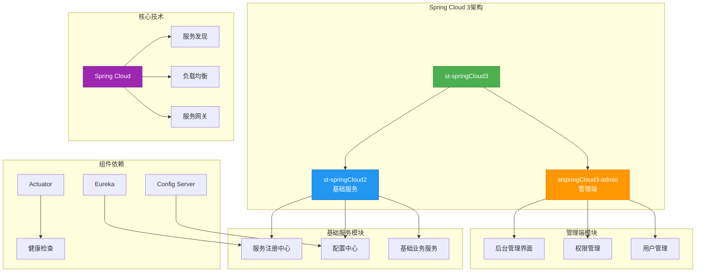

# st-springCloud3

> 🌐 Spring Cloud微服务学习项目（三）

本项目是Spring Cloud微服务架构学习的第三个阶段，主要包含管理端和客户端的微服务实践。

## 📊 项目架构图

```mermaid
graph TB
    subgraph "Spring Cloud 3架构"
        A[st-springCloud3] --> B[st-springCloud2<br/>基础服务]
        A --> C[stspringCloud3-admin<br/>管理端]
    end
    
    subgraph "基础服务模块"
        B --> D[服务注册中心]
        B --> E[配置中心]
        B --> F[基础业务服务]
    end
    
    subgraph "管理端模块"
        C --> G[后台管理界面]
        C --> H[权限管理]
        C --> I[用户管理]
    end
    
    subgraph "核心技术"
        J[Spring Cloud] --> K[服务发现]
        J --> L[负载均衡]
        J --> M[服务网关]
    end
    
    subgraph "组件依赖"
        N[Eureka] --> D
        O[Config Server] --> E
        P[Actuator] --> Q[健康检查]
    end
    
    style A fill:#4CAF50,stroke:#2E7D32,color:#fff
    style B fill:#2196F3,stroke:#1565C0,color:#fff
    style C fill:#FF9800,stroke:#F57C00,color:#fff
    style J fill:#9C27B0,stroke:#6A1B9A,color:#fff
```